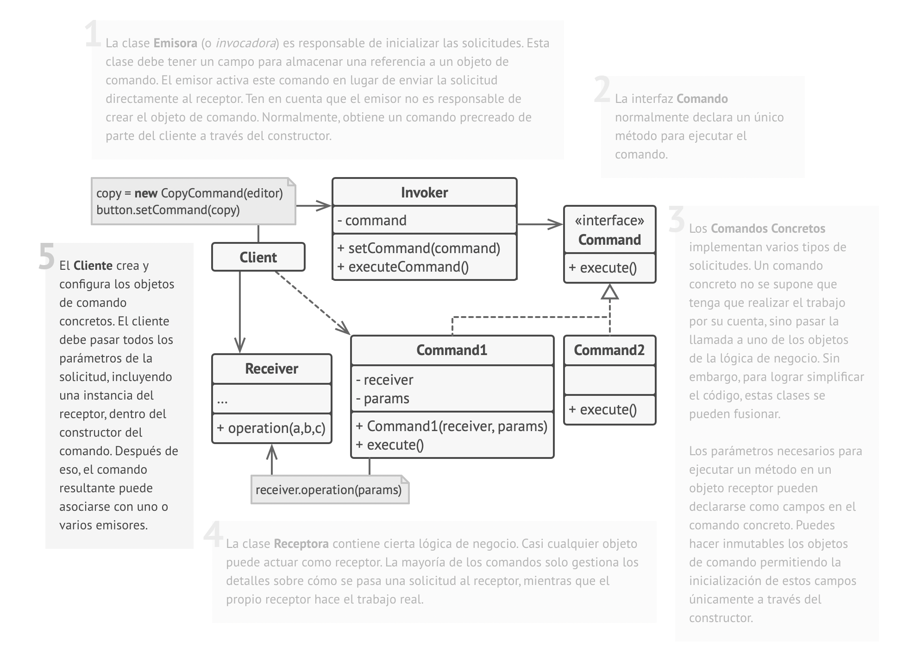

#Command Pattern
The command pattern encapsulates method invocations. Usually you execute the method
just by calling it using an object reference and optionally passing one or more arguments.
Each time, you want to support a new operation, you have to add a method to this class and 
code the method invocation in the appropriate part of the application.

But what if you want to make the invocation more generic?

Maybe you could have just an execute method, and instead of passing a value as the argument
of this method,you could pass an object, a command object that encapsulates an operation.

