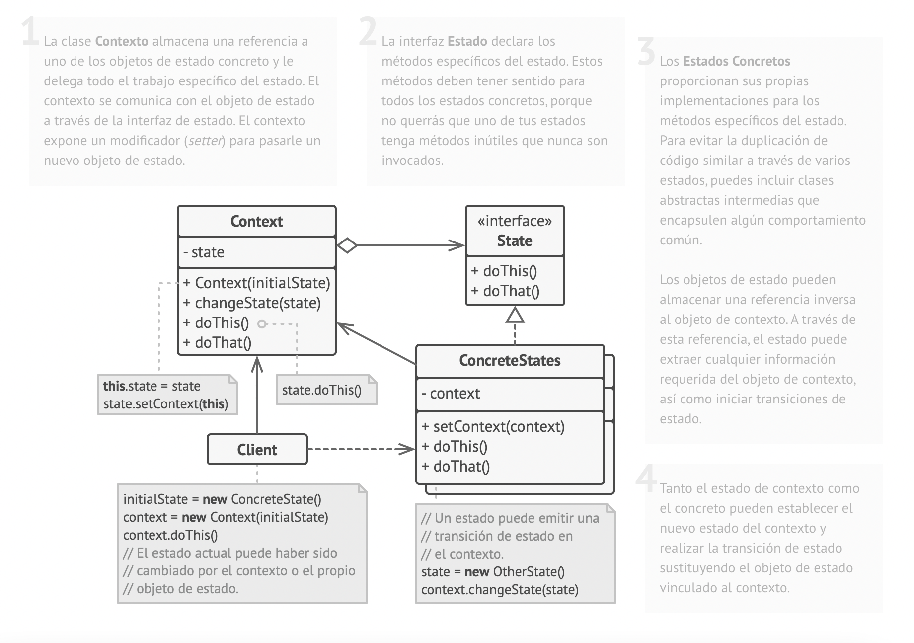

#State Pattern
An object's state is the combination of the values of its attributes.
So what the state pattern says is that we should model states as objects,
encapsulating a state as specific methods in separate classes.

For this, first we create either an interface, or an abstract class to hold
the methods that change according to the state of the object, and then create
classes that represent each possible state. These classes will implement
the interface or extend the after class to redefine the behavior of the methods
according to the state.

