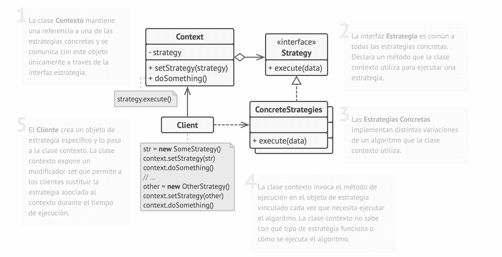

#Strategy Pattern
A strategy is a synonym for a plan or an approach for doing something.

A strategy can be also compared to an algorithm. Something that produces an output from an input.

We need to do is create an interface that defines the operation that we want to encapsulate and implement the interface with classes that represent each strategy.
Then we need to modify the class that is going to select and use an instance of the strategy class.
This class in the pattern's documentation is called context and has a reference to the strategy interface.

This way via polymorphism, we can configure any of the concrete classes that represent a variation of the strategy.

